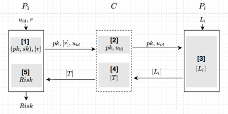

#  多头共债协议

## 简介

* 基于同态加密的多头共债。基本思想：
该协议是基于同态加密进行多头风险计算，计算过程中需要对每个参与方的数据进行加密后再上传至第三方，第三方对密文数据进行汇总。而第三方在汇总时不能进行解密。

* 协议过程：假设有n个参与方作为服务方P_i提供用户贷款额，由第三方向发起方提供查询服务。协议中第三方会向服务方查询对应用户ID的贷款额，并进行汇总和风险计算，只是所有的运算是在密文空间上进行的，最后将结果反馈给发起方解密。

* 算法流程图


* 依赖的运行环境
    1. numpy>=1.18.4

* 协议流程，详见：[FLEX白皮书](../../../../doc/FLEX白皮书.pdf)4.1.1章节

## 类和函数

`HE_ML`协议定义了三种类型的参与方，分别是`Coordinator`,`Guest`,`Host`，它们对应的类函数、初始化参数、类方法如下：

| | Coordinator | Guest | Host |
| ---- | ---- | ---- | ---- |
| class |`HEMLCoord` | `HEMLGuest` | `HEMLTHost` |
| init | `federal_info`, `sec_param` | `federal_info`, `sec_param` | `fedral_info`, `sec_param` |
| method | `exchange` | `exchange` | `exchange` |

### 初始化参数

每种参与方在初始化时需要提供`federal_info`和`sec_param`两种参数。其中`federal_info`提供了联邦中参与方信息，`sec_param`是协议的安全参数。

* `sec_param`中需提供的参数有：
   * 使用`list`嵌套`list`形式存储加密信息，第一层`list`存储此次协议所有加密方式(协议只会用到一种加密协议)；第二层`list`的第一个元素表示加密的方法(协议采用`paillier`加密)，第二个元素表示该加密方法需要用到的参数(`paillier`加密需要秘钥的长度`key_length`)

```python
[["paillier", {"key_length": 1024}],]
```

* `algo_param`中，本协议不需要的算法参数，故`algo_param = {}`

### 类方法

每种参与方均提供`exchange`方法，如下

```python
# Coordinator
def exchange(self)
# Guest
def exchange(self, u_id: str, r_raw: Union[int, float])
# Host
def exchange(self, req_loan: Callable)
```

#### 输入

Coordinator无需输入参数，其他参数意义如下：
* `u_id`: 表示被查询用户的id，为字符串类型。
* `r_raw`: 表示额度限额，为整数或者浮点数。
* `req_loan`: 查询函数，接受u_id为参数，返回该用户额度，返回类型为整数或者浮点数。

例如：

```python
u_id = 'user_A'
r_raw = 50000.0
def req_loan(u_id):
    return 60000.0
```

#### 输出

`Coordinator`和`Host`无输出，`Guest`方的输出为贷款总额是否超过阈值，用0和1表示。

## API调用

每种参与方均通过如下方式初始化：

```python
from flex.api import make_protocol
from flex.constants import HE_ML

protocol = make_protocol(HE_ML, federal_info, sec_param, algo_param=None)
```

调用时，根据`federal_info`中参与方角色的不同，分别返回`HEMLCoord`，`HEMLGuest`和`HEMLHost`三种类实例。

### 调用示例

`Host`方调用示例详见：[host.py](../../../../test/computing/multi_loan/he_ml/test_host.py)


`Guest`方调用示例详见：[guest.py](../../../../test/computing/multi_loan/he_ml/test_guest.py)


`Coordinator`方调用示例详见：[coordinator.py](../../../../test/computing/multi_loan/he_ml/test_coordinator.py)