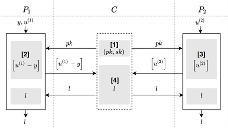

#  线性回归
## 简介
* 跨特征联邦线性回归训练。基本思想：由于跨特征联邦线性回归中关键是计算损失函数，因此不同参与方可以先利用本地数据计算，将得到的中间结果加密后上传至第三方，由第三方汇总后解密，再反馈给各参与方。

* 协议过程：
假定两个参与方，一个是发起方P_1，一个是服务方P_2，分别利用本地数据训练模型。用同态加密通过第三方计算出需要更新的量，分发给各个参与方。

* 算法流程图

 

* 依赖的运行环境
    1. numpy>=1.18.4

* 协议流程，详见：[FLEX白皮书](../../../../doc/FLEX白皮书.pdf)5.1章节

## 类和函数
HE_Lienar_FT协议定义了三种类型的参与方，分别是Coordinator,Guest,Host，它们对应的类函数、初始化参数、类方法如下：

| | Coordinator | Guest | Host |
| ---- | ---- | ---- | ---- |
| class |HELinearFTCoord | HELinearFTGuest | HELinearFTHost |
| init | federal_info, sec_param | federal_info, sec_param | fedral_info, sec_param |
| method | exchange | exchange | exchange |

### 初始化参数
每种参与方在初始化时需要提供federal_info和sec_param两种参数。其中federal_info提供了联邦中参与方信息，sec_param是协议的安全参数。

* sec_param中需提供的参数有：
   * he_algo: 同态加密算法名
   * he_key_length: 同态加密密钥长度

   如:
    ```json
    {
        "he_algo": "paillier",
        "he_key_length": 1024
    }
    ```

### 类方法
每种参与方均提供exchange方法，如下
```python
# Coordinator
def exchange(self)
# Guest
def exchange(self, u: np.ndarray, y: np.ndarray)
# Host
def exchange(self, u: np.ndarray)
```

#### 输入
Coordinator无需输入参数，其他参数意义如下：
* u: 表示$`\theta x^T`$，为1维numpy.ndarray，长度等于batch大小；
* y: 表示label，用一维numpy.ndarray表示，长度等于batch大小，值为-1或1。

例如：
```python
u = np.random.uniform(-1, 1, (32,))
y = np.random.randint(0, 2, (32,))
```

#### 输出
Coordinator无输出，Guest方和Host方的输出为loss值。

## API调用
每种参与方均通过如下方式初始化：
```python
from flex.api import make_protocol
from flex.constants import HE_LINEAR_FT

protocol = make_protocol(HE_LINEAR_FT, federal_info, sec_param, algo_param=None)
```
调用时，根据federal_info中参与方角色的不同，分别返回HELinearFTCoord，HELinearFTGuest和HELinearFTHost三种类实例。

### 调用示例
#### Host

详见：[host.py](../../../../test/federated_training/linear_regression/he_linear_ft/host.py)

#### Guest

详见：[guest.py](../../../../test/federated_training/linear_regression/he_linear_ft/guest.py)

#### Coordinator

详见：[coordinator.py](../../../../test/federated_training/linear_regression/he_linear_ft/coordinator.py)

### 训练示例
#### Host

详见：[test_host.py](../../../../test/federated_training/linear_regression/he_linear_ft/test_host.py)

#### Guest

详见：[test_guest.py](../../../../test/federated_training/linear_regression/he_linear_ft/test_guest.py)

#### Coordinator

详见：[test_coordinator.py](../../../../test/federated_training/linear_regression/he_linear_ft/test_coordinator.py)
