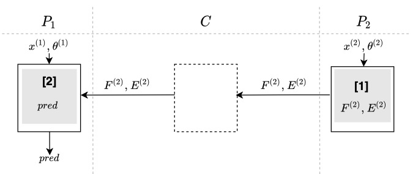

# 因子分解机FM预测协议

## 简介
* 因子分解机FM预测(无第三方)，该协议参与方先分别计算本地FM模型，训练后数据进行交互计算预测结果。  
	* 应用场景:  
		* 利用FM模型进行训练时可采用本协议
	
	* 相关技术: 
		* 推荐算法Factorization machine

	* 算法流程图  
        

    * 安全要求
        数据交换的过程保证安全，传输的数据不会产生隐私泄漏。
        
    * 依赖的运行环境
		*  numpy>=1.18.4
   
    * 协议流程，详见: [FLEX白皮书](../../../../doc/FLEX白皮书.pdf)5.6章节

## 类和函数
* `FM_FP`协议定义了两种类型的参与方，分别是`Guest`(发起方)和`Host`(参与方), 它们对应的类函数、初始化参数、类方法如下

| | Guest | Host |
| ---- | ---- | ---- |
| class | `FMFPGuest` | `FMFPHost` |
| params | `federal_info`, `sec_param`, `algo_param` | `federal_info`, `sec_param`, `algo_param`|
| methods | `exchange` | `exchange` |

### 参数初始化
发起方和参与方在协议初始化时都需要提供`federal_info`, `sec_param`和`algo_param`三个初始化参数。其中，`federal_info`提供了联邦中参与方信息，`sec_param`提供了协议的安全参数信息，`algo_param`提供了协议的函数参数信息。

* `sec_param`中需提供的参数有：
   * 使用`list`嵌套`list`形式存储加密信息，第一层`list`存储此次协议所有加密方式；第二层`list`的第一个元素表示加密的方法，第二个元素表示该加密方法需要用到的参数(`paillier`加密需要秘钥的长度`key_length`)，本协议中为空。
   
* `algo_param`中，本协议不需要模型训练的算法参数，故`algo_param = {}`

### 类方法
发起方和参与方均通过`exchange`方法进行协议的实现

```python
# Guest
def exchange(self, theta: np.ndarray, v: np.ndarray, features: np.ndarray, *args, **kwargs) -> np.ndarray

# Host
def exchange(self, theta: np.ndarray, v: np.ndarray, features: np.ndarray, *args, **kwargs) -> None
```

#### 入参说明
* `theta`: FM模型权重参数，用一维`numpy.ndarray`表示，长度等于特征长度；
* `v`: FM模型权重参数，用二维`numpy.ndarray`表示，长度等于特征长度；
* `features`: 模型训练时一个`batch`输入的数据信息，用二维`numpy.ndarray`表示，`shape`为`(batch_size, num_features)`;

#### 输出
`Guest`方的输出为`batch`内的预测结果`predict`，用一维`numpy.ndarray`表示；

`Host`方无输出

### `FM_FP`调用示例

`Host`(参与方)调用示例详见：[host.py](../../../../test/prediction/factorization_machines/he_fm_ft/host.py)

`Guest`(发起方)调用示例详见：[guest.py](../../../../test/prediction/factorization_machines/he_fm_ft/guest.py)
