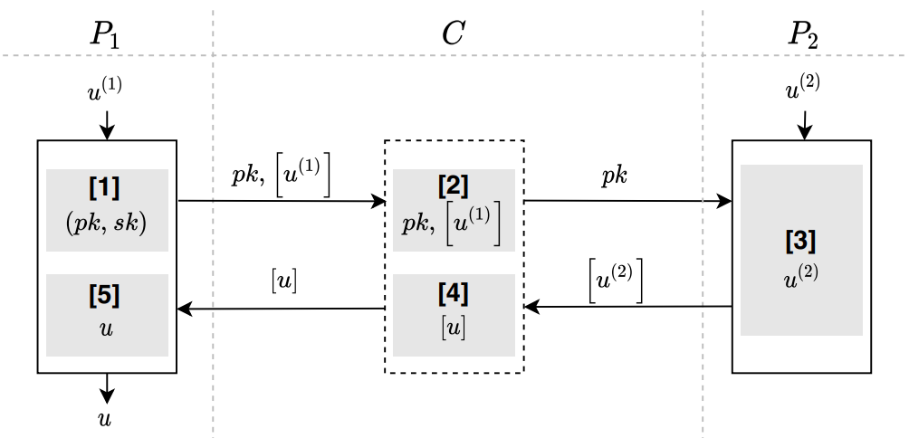

#  联邦预测

## 简介
* 跨特征联邦逻辑回归预测。逻辑回归联邦预测的核心是将对各方计算的中间结果汇总求和。因此可以将各方计算的中间结果输入第三方，让第三方帮助完成计算，这样既可以保证预测数据，也可以保证模型参数不会被泄漏。
    * 应用场景:  
        * 应用于跨特征联邦逻辑回归预测中。
        
    * 相关技术: 
        * paillier同态加密,具体参考[paillier加密](../../../crypto/paillier/README.md)
        * AES对称加密
        
    * 算法流程图  
        
        
    * 安全要求:  
        数据交换的过程保证安全，传输的数据不会产生隐私泄漏，即其中一方无法根据接收到的密文求解或推算出另一方的明文数据; 
         
    * 依赖的运行环境
        1. numpy>=1.18.4
        2. gmpy2==2.0.8
        
    * 协议流程，详见: [FLEX白皮书](../../../../doc/FLEX白皮书.pdf)6章节

## 类和函数
HE_LR_FP协议定义了三种类型的参与方，分别是Coordinator,Guest,Host，它们对应的类函数、初始化参数、类方法如下：

| | Coordinator | Guest | Host |
| ---- | ---- | ---- | ---- |
| class | HELRFPCoord | HELRFPGuest | HELRFPHost |
| init | federal_info, sec_param | federal_info, sec_param | fedral_info, sec_param |
| method | exchange | exchange | exchange |

### 初始化参数
每种参与方在初始化时需要提供federal_info和sec_param两种参数。其中federal_info提供了联邦中参与方信息，sec_param是协议的安全参数。

* sec_param中需提供的参数如下：
   * he_algo: 同态加密算法名
   * key_length: 同态加密密钥长度
   
    ```python
    [['paillier', {"key_length": 1024}], ]
    ```

### 类方法
每种参与方均提供exchange方法，如下

```python
# Coordinator
def exchange(self) -> None
# Guest
def exchange(self, u1: np.ndarray) ->np.ndarray
# Host
def exchange(self, u2: np.ndarray) -> None
```

#### 输入
Coordinator无需输入参数，其他参数意义如下：
* u1: 表示参与方Guest提供的本地模型计算的中间结果，为1维numpy.ndarray表示；
* u2: 表示参与方Host提供的本地模型计算的中间结果，为1维numpy.ndarray表示。

#### 输出
Coordinator和Host无输出，Guest方的输出为各参与方汇总的u。

### 调用示例
#### Coord
详见: [coordinator.py](../../../../test/prediction/logistic_regression/he_lr_fp/coordinator.py)

#### Guest
详见: [guest.py](../../../../test/prediction/logistic_regression/he_lr_fp/guest.py)

#### Host
详见: [host.py](../../../../test/prediction/logistic_regression/he_lr_fp/host.py)
