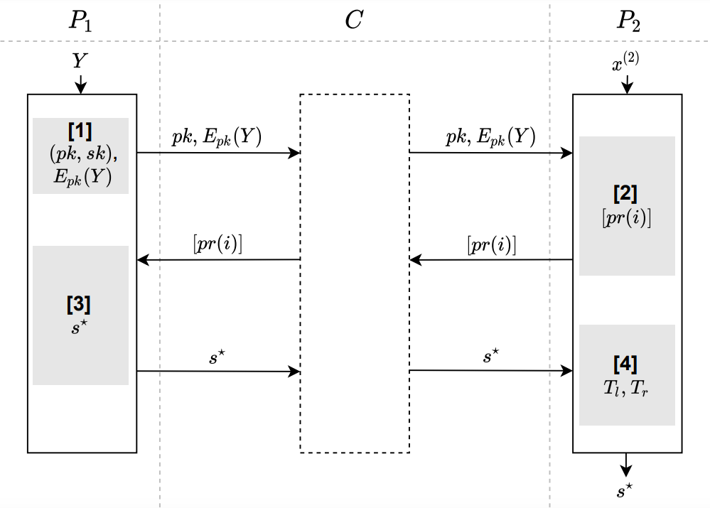

#  联邦分箱-决策树分箱协议
## 简介
* 决策树分箱是一种有监督的分箱方法，通常用于对连续变量的离散化。决策树分箱使用基尼增益作为切分点标准，依次计算相邻两个元素值的中位数，将数据集一分为二，计算该点作为分割点时的基尼值与分割前基尼值的下降程度，每次切分时，选择基尼下降程度最大的点作为最优切分点，循环上述方法，直至达到终止条件，此时得到基于决策树分箱的最优切分点信息。
  * 应用场景:  
    当一个特征的值较多，使用分箱协议可以减少特征值的数量。分箱作为一种编码方式，特征分箱后，模型对具体数值不敏感，常用于评分卡场景。
  * 相关技术: 
    `paillier`同态加密,具体参考[paillier加密](../../../crypto/paillier/README.md);  
  * 算法流程图  
    
  * 安全要求:  
    1.参与方的特征数据是在本地计算，特征数据不对外泄漏;  
    2.标签信息采用同态加密不对外泄漏.
  * 依赖的运行环境
    1. `numpy>=1.18.4`
    2. `pandas>=0.23.4`
    3. `gmpy2==2.0.8`
  * 协议流程，详见: [FLEX白皮书](../../../../doc/FLEX白皮书.pdf)3.1.1章节

## 类和函数
`HE_DT_FB`协议定义了两种类型的参与方，分别是`Guest`,`Host`，它们对应的类函数、初始化参数、类方法如下：

|`Category` | `Guest` | `Host` |
| ---- | ---- | ---- |
| `class` | `HEDTFBGuest` | `HEDTFBHost` |
| `init param` | `federal_info`, `sec_param`, `algo_param` | `fedral_info`, `sec_param`, `algo_param` |
| `method` | `pre_exchange`, `exchange` | `pre_exchange`, `exchange` |

### 初始化参数
每种参与方在初始化时需要提供`federal_info`、`sec_param`和`algo_param`三种参数。其中`federal_info`提供了联邦中参与方信息，`sec_param`是协议的安全参数，`algo_param`是协议的算法参数。

* `sec_param`中需提供的参数有：
   * 使用`list`嵌套`list`形式存储加密信息，第一层`list`存储此次协议所有加密方式(决策树分箱协议只会用到一种加密协议)；第二层`list`的第一个元素表示加密的方法(决策树分箱协议采用`paillier`加密)，第二个元素表示该加密方法需要用到的参数(`paillier`加密需要秘钥的长度`key_length`)
   
	```python
	[["paillier", {"key_length": 1024}],]
	```

* `algo_param`中需要提供的参数有：
    * `host_party_id`：本轮交互`host`的ID信息
    * `max_bin_num`：最大的分箱数量
    * `frequent_value`：初始化的分箱数量
    
   
    ```json
    {   
        "host_party_id": "zhibang-d-014010",
        "max_bin_num": 6,
        "frequent_value": 10
    }
    ```

### 类方法
发起方和参与方根据`pre_exchange	`进行加密的标签传输，通过`exchange`方法进行DT分箱协议的实现

```python
# Guest
def pre_exchange(self, label: np.ndarray, *args, **kwargs) -> None
def exchange(self, label: np.ndarray, *args, **kwargs) -> None

# Host
def pre_exchange(self, *args, **kwargs) -> np.ndarray
def exchange(self, feature: np.ndarray, *args, **kwargs) -> np.ndarray
```

#### 入参说明
* `label`: 表示发起方提供的标签，数据类型可以为`numpy.ndarray`，`label`长度与`feature`相同.
* `feature`: 表示参与方提供的待分箱的特征数据，数据类型可以为`numpy.ndarray`，`feature`长度与`label`相同.

#### 输出
* `Guest`均无输出
* `Host`方在`pre_exchange`中输出为加密的`label`信息；在`exchange`中输出划分点的信息，数据类型为`numpy.ndarray`.

### `HE_DT_FB`调用示例
`Host`(参与方)使用`HE_DT_FB`协议的示例详见：[host.py](../../../../test/preprocessing/binning/he_dt_fb/host.py)

`Guest`(发起方)使用`HE_DT_FB`协议的示例详见：[guest.py](../../../../test/preprocessing/binning/he_dt_fb/guest.py)

