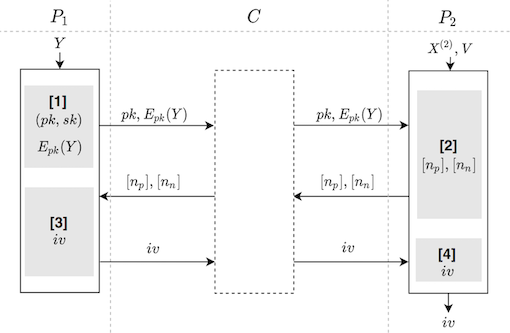

#  信息价值特征选择
## 简介
* 基于信息价值(`information value: IV`)的联邦特征选择协议，联邦特征选择(`federated feature selection: FFS`)是指对所有参与方数据的特征进行联合协同筛选，去除参与方之间重复冗余的特征，只保留更重要的特征指标，以提高训练数据质量并缩短训练时间。
  而`IV`值的计算以证据权重(`WOE`)为基础，分别定义$`p_{y_i}`$是第$`i`$个分箱中正样本占所有正样本的比例，$`p_{n_i}`$是第$`i`$个分箱中负样本占所有负样本的比例。那么第$`i`$个分箱的证据权重为$`woe_i=ln(p_{y_i}/p_{n_i})`$，相应的IV值是:$`iv_i=(p_{y_i}-p_{n_i})*woe_i`$。整个特征变量的信息价值是各分箱信息价值的和:$`iv=\sum_{i}iv_i`$。
  
  * 应用场景:  
    适用于跨特征联邦场景下的信息价值的计算，常用于特征选择。
    
  * 相关技术: 
    `paillier`同态加密,具体参考[paillier加密](../../../crypto/paillier/README.md);  
    
  * 算法流程图  
    
    
  * 安全要求:  
    1.特征向量在本地统计，特征数据不对外泄漏;  
    2.标签信息采用同态加密不对外泄漏.
    
  * 依赖的运行环境
    1. `numpy>=1.18.4`
    2. `pandas>=0.23.4`
    3. `gmpy2==2.0.8`
  
  * 协议流程，详见: [FLEX白皮书](../../../../doc/FLEX白皮书.pdf)`3.2.2`章节


## 类和函数
`IV_FFS`协议定义了两种类型的参与方，分别是`Guest`,`Host`，它们对应的类函数、初始化参数、类方法如下：

| | Guest | Host |
| ---- | ---- | ---- |
| class | `IVFFSGuest` | `IVFFSHost` |
| init | `federal_info`, `sec_param`, `algo_param` | `fedral_info`, `sec_param`, `algo_param` |
| method | `pre_exchange`, `exchange` | `pre_exchange`, `exchange` |

### 初始化参数
每种参与方在初始化时需要提供`federal_info`、`sec_param`和`algo_param`三种参数。其中`federal_info`提供了联邦中参与方信息，`sec_param`是协议的安全参数， `algo_param`是协议的算法参数。

* `sec_param`中需提供的参数有：
   * 使用`list`嵌套`list`形式存储加密信息，第一层`list`存储此次协议所有加密方式(`IV`协议只会用到一种加密协议)；第二层`list`的第一个元素表示加密的方法(`IV`协议采用`paillier`加密)，第二个元素表示该加密方法需要用到的参数(`paillier`加密需要秘钥的长度`key_length`)
 
		```python
		[["paillier", {"key_length": 1024}],]
		```

* `algo_param`中需要提供的参数有：
    * `iv_thres`：`IV`的最小阈值
    
   如：
    ```json
    {
        "iv_thres": 0.02
    }
    ```

### 类方法
发起方和参与方均通过`pre_exchange`, `exchange`两种方法进行协议的实现，`pre_exchange`为标签的加密和传输方法，只需调用一次即可，`exchange`为基于特征的统计量计算方法，每个特征都需调用。

```python
# Guest
def pre_exchange(self,
                 label: np.ndarray,
                 *args, **kwargs) -> None
def exchange(self,
             label: np.ndarray,
             *args, **kwargs) -> None
```
```python
# Host
def pre_exchange(self, *args, **kwargs) -> np.ndarray
def exchange(self,
             feature: Optional[Union[pd.Series, np.ndarray]] = None,
             en_labels: Optional[np.ndarray] = None,
             is_category: Optional[bool] = None,
             data_null: Optional[bool] = None,
             split_info: Optional[Dict] = None,
             *args, **kwargs) -> Union[Tuple[float, bool], Tuple[None, None]]
```

#### 输入
参数意义如下：
* `label`: 表示发起方提供的标签，数据类型为`numpy.ndarray`，`label`长度与`feature `相同.  
* `feature`: 表示参与方提供的特征数据，数据类型可以为`numpy.ndarray`或`pandas.Series`，`feature`长度与`label`相同，在一对多场景中，`feature`可不传或传入为`None`.  
* `en_labels `: 表示`pre_exchange`函数调用后得到的加密的标签信息，数据类型为`numpy.ndarray`，`en_labels`长度与`feature`相同，在一对多场景中，`en_labels`可不传或传入为`None`.  
* `is_category`: 表示参与方提供的特征数据类型是否为离散型，若为离散型，则`is_category`为`True`，否则为`False`，在一对多场景中，`is_category`可不传或传入为`None`.  
* `data_null`: 表示参与方提供的特征数据是否存在缺失值，若存在缺失值，则`data_null`为`True`，否则为`False`，在一对多场景中，`data_null`可不传或传入为`None`. 
* `split_info`: 表示参与方提供的特征分箱后的切分点信息，在一对多场景中，`split_info`可不传或传入为`None`.


#### 输出
`Guest`无输出，`Host`方的输出为`IV`值，类型为`float`，以及`IV`是否大于等于给定的阈值，类型为`bool`。

### 调用示例
#### Host
   详见: [host.py](../../../../test/preprocessing/feature_selection/iv_ffs/host.py)
#### Guest
   详见: [guest.py](../../../../test/preprocessing/feature_selection/iv_ffs/guest.py)

