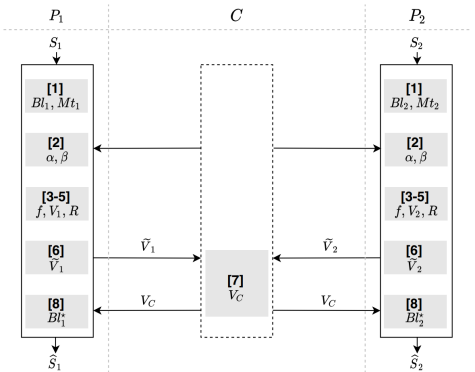

# 样本过滤
## 简介
* 当参与方中有一方样本集合大小过大时（千万级别），推荐使用样本过滤协议来快速过滤大部分的非交集样本，来得到规模较小的样本集合。在过滤后的样本集合上，再进行安全对齐得到真正的样本交集。
    * 应用场景: 至少有一方数据集合大小为千万级别的情景.
    * 相关技术:  
        1. Bloom Filter, 原理参考: https://en.wikipedia.org/wiki/Bloom_filter;
        2. 集合的置换, 基本方法参考[格式保留加密算法](../../../crypto/fpe/README.md);
        3. 序列的替换, 通过将原序列和随机生成的一个掩码做位运算(异或的取反)得到新的序列.
    * 算法流程图  
        
    * 安全要求:  
        1. 参与方不能知道其它参与方的用户ID数据;
        2. 第三方不能知道各参与方的用户ID，以及用户交集的规模.
    * 依赖的运行环境
        1. numpy>=1.18.4
        2. crypto==1.4.1
        3. gmpy2==2.0.8
        4. secrets==1.0.2
    * 协议流程，详见: [FLEX白皮书](../../../../doc/FLEX白皮书.pdf)2.2.1章节
 
## 类和函数
BF_SF协议定义了两种类型的参与方，分别是Coordinator, Party，它们对应的类函数、初始化参数、类方法如下：

| | Coordinator | Party |
| ---- | ---- | ---- |
| class | `BFSFCoord` | `BFSFParty` |
| init | `federal_info`, `sec_param`, `algo_param` | `fedral_info`, `sec_param`, `algo_param` |
| method | `intersect` | `intersect` |

### 初始化参数
每种参与方在初始化时需要提供`federal_info`、`sec_param`和`algo_param`三种参数。其中`federal_info`提供了联邦中参与方信息，`sec_param`是协议的安全参数， `algo_param`是协议的算法参数。

* 本协议中不需要提供`sec_param`，即`sec_param = []`

* `algo_param`中需要提供的参数有：
    * log2_len：样本过滤协议各个参与方需要将样本映射到长度为$`2^{log2\_len}`$长度的filter中.
    
   如：
   
    ```python
    {
      "log2_len": 31
    }
    ```

### 类方法
每种参与方均提供intersect方法，如下
```python
# Coordinator
def intersect(self) -> None
# Party1
def intersect(self, id_filter: Union[IDFilter, None]) -> Union[IDFilter, None]
# Party2
def intersect(self, id_filter: Union[IDFilter, None]) -> Union[IDFilter, None]
```
#### 输入
Coordinator无需输入参数，其他参数意义如下：
* id_filter: 表示样本过滤协议的参与方Guest和Host，对样本做bloom filter映射后的filter, 为1维numpy.ndarray，长度等于$`2^{log2\_len}`$.

例如：
```python
input_data=list(range(6000, 14000))
id_filter = IDFilter(algo_param['log2_len'])
id_filter.update(input_data)
```

#### 输出
Coordinator无输出，参与方的输出为样本过滤后的ids。

### sample_filtering调用示例
#### Host
   详见: [host.py](../../../../test/sharing/sample_alignment/sample_filtering/host.py)
#### Guest
   详见: [guest.py](../../../../test/sharing/sample_alignment/sample_filtering/guest.py)
#### Coordinator
   详见: [coordinator.py](../../../../test/sharing/sample_alignment/sample_filtering/coordinator.py)
