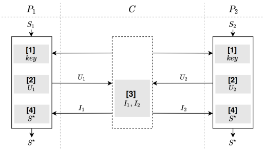

# 安全样本对齐
## 简介
* 第三方辅助的样本对齐协议，主要思想是利用安全密钥交换协议，参与方（不包括第三方）协商一个共同的密钥，使用该密钥加密本方待对齐的样本ID，将密文发送至第三方，第三方在密文集合上求交集并将对齐顺序信息返回给参与方，各个参与方按顺序提取本方样本集合的子集，从而得到按相同顺序排列的样本交集。
    * 应用场景: 
        * 双方样本集合大小在千万级别以下的情景。
        
    * 相关技术: 
        * Diffie-Hellman密钥交换协议;  
        * AES对称加密;
        
    * 算法流程图  
        
        
    * 安全要求: 
        * 参与方不能知道其它方的用户ID，也不能泄漏交集外的用户样本信息;
        * 第三方不能知道甚至追溯到参与方的用户ID数据.
        
    * 依赖的运行环境
        * numpy>=1.18.4
        * crypto==1.4.1
        * gmpy2==2.0.8
        * secrets==1.0.2
        
    * 协议流程，详见: [FLEX白皮书](../../../../doc/FLEX白皮书.pdf)2.2.2章节
        
## 类和函数
SAL协议定义了两种类型的参与方，分别是`Coordinator`, `Party`，它们对应的类函数、初始化参数、类方法如下：

| | Coordinator | Party |
| ---- | ---- | ---- |
| class | `SALCoord`| `SALParty` |
| init | `federal_info`, `sec_param` | `fedral_info`, `sec_param` |
| method | `align`, `verify` | `align`, `verify` |

### 初始化参数
每种参与方在初始化时需要提供`federal_info`、`sec_param`和`algo_param`三种参数。其中`federal_info`提供了联邦中参与方信息，sec_param是协议的安全参数， algo_param是协议的算法参数。

* `sec_param`中需提供的参数有：
   * 使用`list`嵌套`list`形式存储加密信息，第一层`list`存储此次协议所有加密方式；第二层`list`的第一个元素表示加密的方法，第二个元素表示该加密方法需要用到的参数
 
   本协议中使用AES加密，`sec_param`如下:
   
    ```python
    [['aes', {'key_length': 128}]]
    ```
  
* 本协议中不需要`algo_param`，所以提供`algo_param`为空

### 类方法
每种参与方均提供`align`和`verify`方法，如下

```python
# Coordinator
def align(self) -> None
def verify(self) -> None
# Party
def align(self, ids: list) -> list
def verify(self, ids: list) -> bool
```

#### 输入
`Coordinator`无需输入参数，其他参数意义如下：
* `ids`: 表示安全对齐协议的参与方`Party`，需要安全对齐的样本列表，长度为样本的数量.

例如：

```python
ids = list(range(1000))
```

#### 输出
`Coordinator`无输出，若为对齐过程，则`Party`方的输出为样本对齐后的`ids`，若为验证过程，则`Party`方的输出为是否对齐。

### secure_alignment调用示例

参与方`Host`调用示例详见: [host.py](../../../../test/sharing/sample_alignment/secure_alignment/host.py)

参与方`Guuest`调用示例详见: [guest.py](../../../../test/sharing/sample_alignment/secure_alignment/guest.py)

中间方`Coordinator`调用示例详见: [coordinator.py](../../../../test/sharing/sample_alignment/secure_alignment/coordinator.py)


