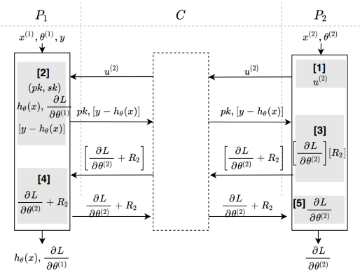

# 跨特征逻辑回归训练协议

## 简介
* 跨特征联邦逻辑回归训练(无第三方)，分别使用同态加密(`homomorphic encryption`: `HE`)和一次一密(`one-time pad`)实现数据安全交换。该协议由发起方生成私钥，参与方在密文上运算梯度并盲化后交给发起方解密，全程无需第三方参与。  
	* 应用场景:  
		* 在跨特征联邦训练中，如果模型采用逻辑回归模型，参与方之间协同计算模型参数更新时可以采用该协议
	
	* 相关技术: 
		* paillier同态加密，具体参考安全公共组件[paillier](../../../crypto/paillier/README.md)的实现
		* 逻辑回归算法

	* 算法流程图  
        

    * 安全要求
        数据交换的过程保证安全，传输的数据不会产生隐私泄漏，即其中一方无法根据接收到的密文求解或推算出另一方的明文数据。
        
    * 依赖的运行环境
		*  numpy>=1.18.4
		*  gmpy2==2.0.8
		* secrets==1.0.2
   
    * 协议流程，详见: [FLEX白皮书](../../../../doc/FLEX白皮书.pdf)5.2.1章节

## 类和函数
* `HE_OTP_LR_FT1`协议定义了两种类型的参与方，分别是`Guest`(发起方)和`Host`(参与方), 它们对应的类函数、初始化参数、类方法如下

| | Guest | Host |
| ---- | ---- | ---- |
| class | `HEOTPLR1Guest` | `HEOTPLR1Host` |
| params | `federal_info`, `sec_param`, `algo_param` | `federal_info`, `sec_param`, `algo_param`|
| methods | `exchange` | `exchange` |

### 参数初始化
发起方和参与方在协议初始化时都需要提供`federal_info`, `sec_param`和`algo_param`三个初始化参数。其中，`federal_info`提供了联邦中参与方信息，`sec_param`提供了协议的安全参数信息，`algo_param`提供了协议的函数参数信息。

* `sec_param`中需提供的参数有：
   * 使用`list`嵌套`list`形式存储加密信息，第一层`list`存储此次协议所有加密方式(树节点分裂协议只会用到一种加密协议)；第二层`list`的第一个元素表示加密的方法(树节点分类协议采用`paillier`加密)，第二个元素表示该加密方法需要用到的参数(`paillier`加密需要秘钥的长度`key_length`)
 
		```python
		[["paillier", {"key_length": 1024}],]
		```
   
* `algo_param`中，本协议不需要LR模型训练的算法参数，故`algo_param = {}`

### 类方法
发起方和参与方均通过`exchange`方法进行协议的实现

```python
# Guest
def exchange(self, theta: np.ndarray, features: np.ndarray, labels: np.ndarray) -> np.ndarray

# Host
def exchange(self, theta: np.ndarray, features: np.ndarray) -> np.ndarray
```

#### 入参说明
* `theta`: 逻辑回归模型权重参数，用一维`numpy.ndarray`表示，长度等于特征长度；
* `features`: 模型训练时一个`batch`输入的数据信息，用二维`numpy.ndarray`表示，`shape`为`(batch_size, num_features)`;
* `labels`: 样本的标签，用一维`numpy.ndarray`表示，长度等于`batch`大小，值为`0`或`1`.

#### 输出
`Guest`方的输出有两个，一是$`sigmoid(\theta feature^T)`$，二是`batch`内的平均梯度，用一维`numpy.ndarray`表示；

`Host`方的输出为`batch`内的平均梯度，用一维`numpy.ndarray`表示。

### `HE_OTP_LR_FT1`调用示例

`Host`(参与方)调用示例详见：[host.py](../../../../test/training/logistic_regression/he_otp_lr_ft1/test_host.py)

`Guest`(发起方)调用示例详见：[guest.py](../../../../test/training/logistic_regression/he_otp_lr_ft1/test_guest.py)

### 使用`HE_OTP_LR_FT1`协议进行模型训练

`Host`(参与方)使用`HE_OTP_LR_FT1`协议进行完整的LR训练的示例详见：[test_host.py](../../../../test/training/logistic_regression/he_otp_lr_ft1/host.py)

`Guest`(发起方)使用`HE_OTP_LR_FT1`协议进行完整的LR训练的示例详见：[test_guest.py](../../../../test/training/logistic_regression/he_otp_lr_ft1/guest.py)

