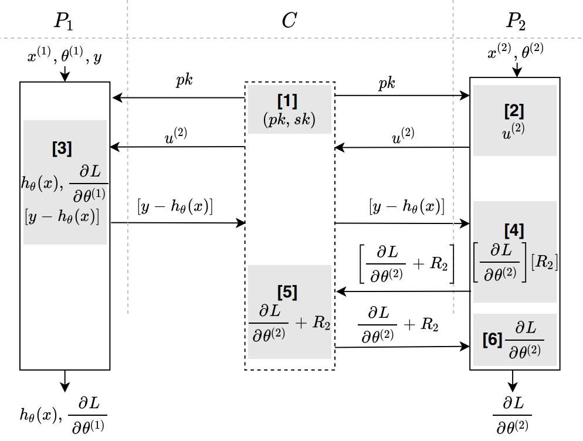

#  逻辑回归
## 简介
* 跨特征联邦逻辑回归训练（有第三方），使用同态加密(`homomorphic encryption`: `HE`)和一次一密(`one-time pad`)实现数据安全交换，该协议由第三方生成私钥，发起方为服务方在密文上运算梯度并使用服务方的随机数盲化，计算结果交给第三方解密。  
    * 应用场景:  
        在跨特征联邦训练中，如果模型采用逻辑回归模型，参与方之间协同计算模型参数更新时可以采用该协议。在二分类中，该协议要求标签信息取值为0或1。
        
    * 相关技术: 
        1. `paillier`同态加密,具体参考公共组件[paillier加密](../../../crypto/paillier/README.md);  
        2. 逻辑回归算法;

    * 算法流程图  
        
    
    * 安全要求:  
        数据交换的过程保证安全，传输的数据不会产生隐私泄漏，即其中一方(包括第三方)无法根据接收到的密文求解或推算出另一方的明文数据; 
      
    * 依赖的运行环境
        1. numpy>=1.18.4
        2. gmpy2==2.0.8
        3. secrets==1.0.2
    
    * 协议流程，详见: [FLEX白皮书](../../../../doc/FLEX白皮书.pdf)5.2.2章节

## 类和函数
HE_OTP_LR_FT2协议定义了三种类型的参与方，分别是Coordinator,Guest,Host，它们对应的类函数、初始化参数、类方法如下：

| | Coordinator | Guest | Host |
| ---- | ---- | ---- | ---- |
| class |`HEOTPLogisticRegressionCoord`| `HEOTPLogisticRegressionGuest`| `HEOTPLogisticRegressionHost` |
| init | `federal_info`, `sec_param` | `federal_info`, `sec_param` | `fedral_info`, `sec_param` |
| method | `exchange` | `exchange` | `exchange` |

### 初始化参数
每种参与方在初始化时需要提供`federal_info`和`sec_param`两种参数。其中`federal_info`提供了联邦中参与方信息，`sec_param`是协议的安全参数。

* `sec_param`中需提供的参数有：
   * 使用`list`嵌套`list`形式存储加密信息，第一层`list`存储此次协议所有加密方式(树节点分裂协议只会用到一种加密协议)；第二层`list`的第一个元素表示加密的方法(树节点分类协议采用`paillier`加密)，第二个元素表示该加密方法需要用到的参数(`paillier`加密需要秘钥的长度`key_length`)
 
		```python
		[["paillier", {"key_length": 1024}],]
		```

### 类和函数
每种参与方均提供exchange方法，如下

```python
# Coordinator
def exchange(self) -> None

# Guest
def exchange(self, theta: np.ndarray, features: np.ndarray, labels: np.ndarray) -> Tuple[np.ndarray, np.ndarray]

# Host
def exchange(self, theta: np.ndarray, features: np.ndarray) -> np.ndarray
```

#### 入参说明
`Coordinator`无需输入参数，其他参数意义如下：

* `theta`: 表示参与方对应的模型参数， 用一维`numpy.ndarray`表示，长度等于特征长度
* `features`:表示本次训练batch内的输入特征，用二维`numpy.ndarray`表示，数据的维度为(`batch_size`, `num_features`);
* `labels`: 表示`label`，用一维`numpy.ndarray`表示，长度等于`batch`大小，值为0或1.


#### 输出
`Coordinator`无输出
`Guest`方的输出有两个，一是$`sigmoid(\theta feature^T)`$，二是`batch`内的平均梯度，用一维`numpy.ndarray`表示
`Host`方的输出为`batch`内的平均梯度，用一维`numpy.ndarray`表示。

### `HE_OTP_LR_FT2`调用示例

`Host`(参与方)调用示例详见：[host.py](../../../../test/training/logistic_regression/he_otp_lr_ft2/test_host.py)

`Guest`(发起方)调用示例详见: [guest.py](../../../../test/training/logistic_regression/he_otp_lr_ft2/test_guest.py)

`Coordinator`(协调方)调用示例详见: [coordinator.py](../../../../test/training/logistic_regression/he_otp_lr_ft2/test_coordinator.py)

### 使用`HE_OTP_LR_FT2`协议进行模型训练

`Host`(参与方)使用`HE_OTP_LR_FT2`协议进行完整的LR训练的示例详见: [test_host.py](../../../../test/training/logistic_regression/he_otp_lr_ft2/host.py)

`Guest`(发起方)使用`HE_OTP_LR_FT2`协议进行完整的LR训练的示例详见: [test_guest.py](../../../../test/training/logistic_regression/he_otp_lr_ft2/guest.py)
   
`Coordinator`(协调方)使用`HE_OTP_LR_FT2`协议进行完整的LR训练的示例详见: [test_coordinator.py](../../../../test/training/logistic_regression/he_otp_lr_ft2/coordinator.py)