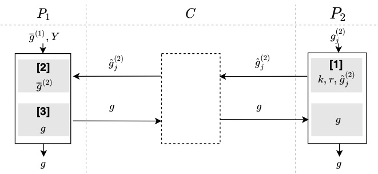

#  神经网络

## 简介
* 跨特征联邦神经网络训练，使用一次一密(`one-time pad`)加入些不影响统计结果的随机噪声，然后再将梯度加密后发给发起方，让其解密后来选择真实的梯度进行统计汇总。
	* 应用场景:  
		* 适用于基于神经网络对跨特征联邦训练中，并且各参与方之间需要采用相同的网络模型。
	
	* 相关技术: 
		* 一次一密，具体参考安全公共组件[one-time pad](../../../crypto/onetime_pad/README.md)的实现
		* 神经网络算法

	* 算法流程图  
        

    * 安全要求
        数据交换的过程保证安全，传输的数据不会产生隐私泄漏，即其中一方无法根据接收到的密文求解或推算出另一方的明文数据。
        
    * 依赖的运行环境
		*  numpy>=1.18.4
		*  torch==1.6.0
   
    * 协议流程，详见: [FLEX白皮书](../../../../doc/FLEX白皮书.pdf)5.3章节
    
## 类和函数
`OTP_NN_FT`协议定义了两种类型的参与方，分别是`Guest`,`Host`，它们对应的类函数、初始化参数、类方法如下：

| | Guest | Host |
| ---- | ---- | ---- |
| class | `OTPNNFTGuest` | `OTPNNFTHost` |
| params | `federal_info`, `sec_param`, `algo_param` | `fedral_info`, `sec_param`, `algo_param` |
| methods | `exchange` | `exchange` |

### 参数初始化
发起方和参与方在协议初始化时都需要提供`federal_info`, `sec_param`和`algo_param`三个初始化参数。其中`federal_info`提供了联邦中参与方信息，`sec_param`是协议的安全参数，`algo_param`提供了协议的函数参数信息。

* `sec_param`中需提供的参数有：
   * 使用`list`嵌套`list`形式存储加密信息，第一层`list`存储此次协议所有加密方式；第二层`list`的第一个元素表示加密的方法(本协议采用`onetime_pad`加密)，第二个元素表示该加密方法需要用到的参数(`onetime_pad`加密需要秘钥的长度`key_length`)

   如:
   
    ```python
    [['onetime_pad', {'key_length': 512}], ]
    ```
    
* `algo_param`中，本协议不需要NN模型训练的算法参数，故`algo_param = {}`

### 类方法
每种参与方均提供exchange方法，如下

```python
# Guest
def exchange(self, grads: Union[list, np.ndarray, torch.Tensor], label: Union[list, np.ndarray, torch.Tensor], *args, **kwargs) -> Union[list, np.ndarray, torch.Tensor]
# Host
def exchange(self, grads: Union[list, np.ndarray, torch.Tensor], *args, **kwargs) -> Union[list, np.ndarray, torch.Tensor]
```

#### 入参说明
* `label`：表示标签，用一维`numpy.ndarray`表示，长度等于`batch`大小
* `grads`：表示对应标签的梯度，注意此处`Host`方由于不知道`label`，所以对应的每一个`label`的每一个`batch`都会计算一个梯度

#### 输出
`Host`方和`Guest`方得到平均梯度。

### `OTP_NN_FT`调用示例

`Host`(参与方)调用示例详见：[host.py](../../../../test/training/neural_network/otp_nn_ft/host.py)

`Guest`(发起方)调用示例详见：[guest.py](../../../../test/training/neural_network/otp_nn_ft/guest.py)
